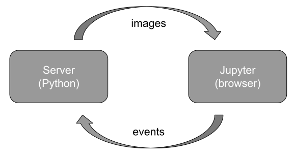

Welcome to the jupyter_rfb docs!
================================

The `jupyter_rfb` library provides a widget (an `ipywidgets` subclass)
that can be used in the Jupyter notebook and in JupyterLab to realize
a *remote frame buffer*.

Images that are generated at the server are streamed to the client
(Jupyter) where they are shown. Events (such as mouse interactions) are
streamed in the other direction, where the server can react by
generating new images.

This *remote-frame-buffer* approach can be an effective method for
server-generated visualizations to be dispayed in Jupyter notebook/lab. For
example visualization created by tools like vispy, datoviz or pygfx.

Contents
--------

.. toctree::
   :maxdepth: 2

   Guide <guide.rst>
   Reference <reference.rst>
   Examples <examples/index.rst>
   Contributor's guide <contributing.rst>

Indices and tables
------------------

* :ref:`genindex`
* :ref:`modindex`
* :ref:`search`
